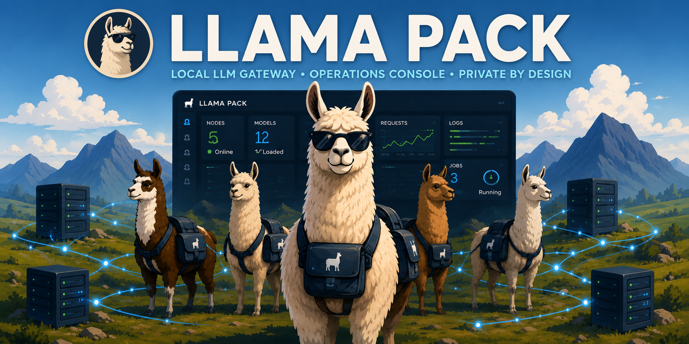

# Llama Pack

Llama Pack is a secure local/private LLM gateway with an operations console.
It gives your apps one stable private AI backend while giving you an operator UI
for the machines, models, keys, routing, logs, and jobs behind it.

The backend runs in two persisted modes:

- `agent`: runs on each model host and manages local `llama-server` processes.
- `controller`: runs on a central host, routes app traffic, and aggregates
  operations across known agents.

The setup wizard also offers a **Standalone** choice for the simplest
single-machine setup. That choice writes an `agent` config with local models
and starts the same operations UI on that host; there is no separate
`mode: standalone` value in `config.yaml`.

In a multi-machine deployment, the controller is the gateway and operations
surface. Agents provide local compute, model lifecycle control, and the
foundation for a private agent runtime.

## Quick Start

Guided setup:

```bash
scripts/setup_llama_pack.sh
```

The wizard asks whether this machine is a controller, agent, or single-machine
setup, then runs dependency sync, onboarding, optional llama.cpp setup, and
optional service startup.

Script-first controller:

```bash
uv sync
scripts/onboard_controller.sh
scripts/start_controller.sh
```

The controller onboarding script writes `.llama_pack.env`, including
`LLAMA_PACK_CONTROLLER_REGISTRATION_KEY`. Give that registration key to each
agent as `LLAMA_PACK_CONTROLLER_REGISTRATION_KEY_OUTBOUND`.

Script-first agent:

```bash
uv sync
scripts/install_llama_cpp.sh --backend auto
cp .llama_pack.env.example .llama_pack.env
# Edit .llama_pack.env:
# - set LLAMA_PACK_CONTROLLER_REGISTRATION_KEY_OUTBOUND to the controller's
#   LLAMA_PACK_CONTROLLER_REGISTRATION_KEY
# - set LLAMA_PACK_CONTROLLER_URL to the controller URL
# - set LLAMA_PACK_AGENT_URL to this agent's URL
set -a
source .llama_pack.env
set +a
scripts/onboard_agent.sh \
  --node linux-2080ti \
  --controller-url "$LLAMA_PACK_CONTROLLER_URL" \
  --agent-url "$LLAMA_PACK_AGENT_URL"
scripts/start_agent.sh
```

The onboarding scripts write local secrets to `.llama_pack.env`, which is
ignored by git. The start/stop helper scripts source that file automatically.

Manual setup, migrations, admin keys, smoke tests, and test commands are in
[Setup](docs/setup.md).

## What It Does

- **Gateway:** exposes OpenAI-compatible `/v1/chat/completions` and Ollama-compatible
  `/api/chat` endpoints for other applications through chat-only external app keys.
- **Operations console:** manages nodes, local `llama-server` processes, model
  lifecycle, downloads, conversion, quantization, logs, benchmarks, auth, and audit.
- **Routing layer:** routes controller chat by `request_type` through configured
  node priorities and returns route metadata to callers.
- **Private runtime foundation:** tracks durable chat threads, route decisions,
  orchestration jobs, memory, and agent-tool execution paths.
- **Personal AI backend:** lets other apps depend on one stable local/private API
  while hardware and models change behind the scenes.

## Documentation

- [Setup](docs/setup.md): install, onboarding scripts, admin keys, migrations, smoke tests, and test commands.
- [Configuration](docs/configuration.md): agent, controller, Raspberry Pi, security, worker, and model capability settings.
- [Agent Tools](docs/agent-tools.md): all tool types, config fields, and safety rules.
- [API](docs/api.md): endpoint list and external OpenAI/Ollama chat compatibility examples.
- [Model Downloads](docs/downloads.md): Hugging Face GGUF download workflow, history, logs, cancellation, and recommendations.
- [Benchmarks](docs/benchmarks.md): benchmark definitions, managed runs, result metrics, and comparisons.
- [How To Use](docs/how-to-use.md): longer end-to-end operating guide.
- [Raspberry Pi Controller Topology](docs/pi-controller-topology.md): current Pi controller deployment notes and smoke checks.
- [Frontend](docs/frontend.md): React development workflow.
- [Plugins](docs/plugins.md): plugin manifest, backend/frontend extension APIs, testing, and hello-world walkthrough.
- [Architecture](docs/architecture.md): contributor-focused code map and review guide.

## Common Commands

```bash
uv sync
scripts/start_controller.sh
scripts/start_agent.sh
scripts/stop_server.sh
scripts/regenerate_key.sh --type controller-registration
scripts/regenerate_key.sh --type agent-api --node linux-2080ti --agent-url "$LLAMA_PACK_AGENT_URL"
uv run pytest -v
```

Prefer `uv sync` for local setup. It uses `uv.lock` and avoids relying on a
shell-specific `python` or `pip` executable. If you need a pip-based install,
use an explicit supported interpreter, for example:

```bash
python3.12 -m venv .venv
source .venv/bin/activate
python -m pip install -e ".[dev]"
```

## External Chat Endpoints

Use `/v1/chat/completions` as the primary integration surface for other apps.
Use `/api/chat` when migrating older Ollama clients. Both endpoints support
controller routing metadata in headers, including `X-Llama-Pack-Thread-Id`,
`X-Llama-Pack-Route`, `X-Llama-Pack-Node`, and
`X-Llama-Pack-Model`.

See [API: External Chat Compatibility](docs/api.md#external-chat-compatibility)
for request examples.

## Notes

- `agent` mode starts `llama-server` with `--model`, `--host`, `--port`, `--ctx-size`, and `--n-gpu-layers`.
- HF model conversion writes `{model-name}.gguf` inside the existing HF model directory, and existing conversion detection checks for any top-level `*.gguf` in that directory.
- Logs are written per model under `log_dir`.
- Process state is tracked in memory, and model status reads reattach to existing
  servers listening on configured model ports after a manager restart.
